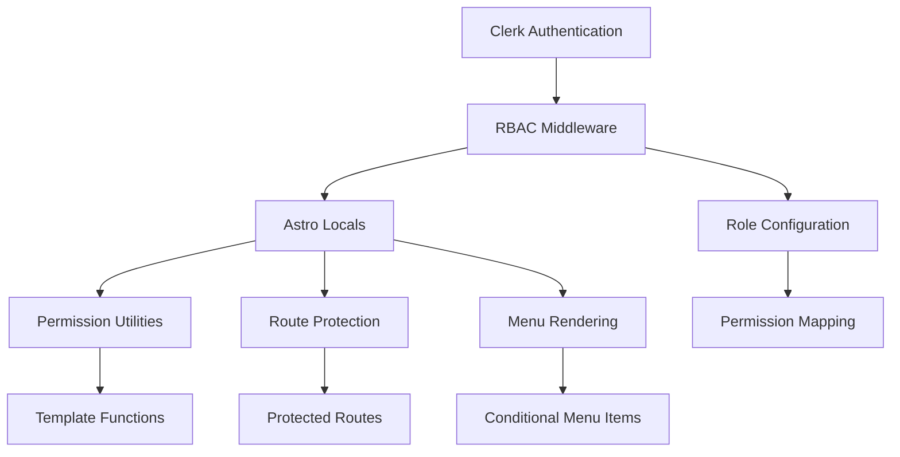

# RBAC MVP Design Document

## Overview

The RBAC MVP system will integrate with the existing Clerk authentication to provide role-based access control for an Astro application. The design emphasizes minimal, maintainable code with clear separation of concerns and comprehensive TypeScript support.

## Architecture

### High-Level Architecture



### Core Components

1. **RBAC Configuration**: Centralized role and permission definitions
2. **Enhanced Middleware**: Extended Clerk middleware with RBAC logic
3. **Permission Utilities**: Template helper functions for conditional rendering
4. **Route Protection**: Middleware-based access control
5. **Menu System**: Permission-aware navigation components

## Components and Interfaces

### Type Definitions

```typescript
// Core RBAC Types
export type Role = 'admin' | 'editor' | 'viewer'

export type Permission = 'write_content' | 'edit_content' | 'manage_user'

export interface RoleConfig {
  [key: Role]: Permission[]
}

export interface UserContext {
  id: string
  email: string
  role: Role
  permissions: Permission[]
}

export interface MenuItem {
  label: string
  href: string
  permissions?: Permission[]
  children?: MenuItem[]
}

export interface RouteConfig {
  pattern: string
  permissions?: Permission[]
  adminOnly?: boolean
}
```

### RBAC Configuration Module

**Location**: `src/lib/auth/rbac-config.ts`

```typescript
export const ROLE_PERMISSIONS: RoleConfig = {
  admin: ['write_content', 'edit_content', 'manage_user'],
  editor: ['write_content', 'edit_content'],
  viewer: []
}

export const PROTECTED_ROUTES: RouteConfig[] = [
  { pattern: '/admin/**', adminOnly: true },
  { pattern: '/content/create', permissions: ['write_content'] },
  { pattern: '/content/edit/**', permissions: ['edit_content'] },
  { pattern: '/users/**', permissions: ['manage_user'] }
]

export const DEFAULT_ROLE: Role = 'viewer'
```

### Enhanced Middleware

**Location**: `src/middleware/index.ts`

The middleware will:
1. Extend the existing Clerk middleware
2. Determine user role (from user metadata or default assignment)
3. Calculate user permissions based on role
4. Store user context in Astro locals
5. Perform route protection checks

```typescript
import { clerkMiddleware } from '@clerk/astro/server'
import type { MiddlewareHandler } from 'astro'
import { getUserRole, getUserPermissions, isRouteProtected } from '../lib/auth/rbac-utils'

export const onRequest: MiddlewareHandler = clerkMiddleware(
  async (auth, context, next) => {
    const { userId, user } = auth()
    
    if (userId && user) {
      const role = getUserRole(user)
      const permissions = getUserPermissions(role)
      
      // Store in Astro locals
      context.locals.user = {
        id: userId,
        email: user.emailAddresses[0]?.emailAddress || '',
        role,
        permissions
      }
      
      // Check route protection
      const routeCheck = isRouteProtected(context.url.pathname, permissions, role)
      if (!routeCheck.allowed) {
        return context.redirect('/403')
      }
    }
    
    return next()
  }
)
```

### Permission Utilities

**Location**: `src/lib/auth/rbac-utils.ts`

Core utility functions for role management and permission checking:

```typescript
export function getUserRole(user: User): Role {
  // Check user metadata for role, fallback to default
  return (user.publicMetadata?.role as Role) || DEFAULT_ROLE
}

export function getUserPermissions(role: Role): Permission[] {
  return ROLE_PERMISSIONS[role] || []
}

export function hasPermission(userPermissions: Permission[], requiredPermission: Permission): boolean {
  return userPermissions.includes(requiredPermission)
}

export function hasAnyPermission(userPermissions: Permission[], requiredPermissions: Permission[]): boolean {
  return requiredPermissions.some(permission => userPermissions.includes(permission))
}

export function isRouteProtected(pathname: string, userPermissions: Permission[], userRole: Role): { allowed: boolean, reason?: string } {
  // Route protection logic
}
```

### Template Utilities

**Location**: `src/lib/auth/template-utils.ts`

Helper functions for use in Astro components:

```typescript
export function canWriteContent(locals: App.Locals): boolean {
  return locals.user?.permissions.includes('write_content') || false
}

export function canEditContent(locals: App.Locals): boolean {
  return locals.user?.permissions.includes('edit_content') || false
}

export function canManageUser(locals: App.Locals): boolean {
  return locals.user?.permissions.includes('manage_user') || false
}

export function hasRole(locals: App.Locals, role: Role): boolean {
  return locals.user?.role === role
}

export function isAdmin(locals: App.Locals): boolean {
  return locals.user?.role === 'admin'
}
```

### Menu Component

**Location**: `src/components/auth/PermissionMenu.astro`

A reusable component for rendering permission-based navigation:

```astro
---
import type { MenuItem } from '@/lib/auth/types'
import { hasAnyPermission } from '@/lib/auth/rbac-utils'

interface Props {
  items: MenuItem[]
}

const { items } = Astro.props
const user = Astro.locals.user

function shouldShowMenuItem(item: MenuItem): boolean {
  if (!item.permissions || item.permissions.length === 0) {
    return true // Show if no permissions required
  }
  
  if (!user) {
    return false // Hide if not authenticated
  }
  
  return hasAnyPermission(user.permissions, item.permissions)
}
---

<nav>
  {items.filter(shouldShowMenuItem).map(item => (
    <a href={item.href}>{item.label}</a>
  ))}
</nav>
```

## Data Models

### Astro Locals Extension

**Location**: `src/types/auth/index.ts`

```typescript
declare global {
  namespace App {
    interface Locals {
      user?: UserContext
    }
  }
}
```

### Role Assignment Strategy

1. **Primary**: Check `user.publicMetadata.role` from Clerk
2. **Fallback**: Assign default role (`viewer`)
3. **Future**: Database-backed role assignment for scalability

## Error Handling

### Route Protection Errors

- **403 Forbidden**: User lacks required permissions
- **401 Unauthorized**: User not authenticated
- **404 Not Found**: Route doesn't exist (maintain security through obscurity)

### Permission Check Errors

- Graceful degradation: Default to most restrictive permissions
- Logging: Track permission check failures for debugging
- Fallback UI: Show appropriate messaging for insufficient permissions

## Testing Strategy

### Unit Tests

**Location**: `tests/unit/`

1. **Role Assignment Tests**
   - Test default role assignment
   - Test role extraction from user metadata
   - Test invalid role handling

2. **Permission Calculation Tests**
   - Test permission mapping for each role
   - Test permission checking functions
   - Test edge cases (empty permissions, invalid roles)

3. **Route Protection Tests**
   - Test protected route matching
   - Test permission validation
   - Test admin-only route access

### Integration Tests

**Location**: `tests/e2e/auth/`

1. **Authentication Flow Tests**
   - Test role assignment after login
   - Test permission persistence across requests
   - Test logout cleanup

2. **Route Access Tests**
   - Test protected route access with various roles
   - Test redirect behavior for unauthorized access
   - Test menu rendering based on permissions

### Component Tests

**Location**: `tests/unit/components/`

1. **Menu Component Tests**
   - Test menu item filtering based on permissions
   - Test rendering with different user contexts
   - Test fallback behavior for unauthenticated users

## Implementation Phases

### Phase 1: Core RBAC Infrastructure
- Type definitions and configuration
- Basic role assignment and permission calculation
- Enhanced middleware with Astro locals integration

### Phase 2: Route Protection
- Protected route configuration
- Middleware-based access control
- Error page handling

### Phase 3: Template Utilities
- Permission checking functions
- Template helper utilities
- Component integration examples

### Phase 4: Menu System
- Permission-aware menu component
- Navigation integration
- Conditional rendering utilities

## Security Considerations

1. **Server-Side Validation**: All permission checks must occur server-side
2. **Client-Side Helpers**: Template utilities are convenience functions, not security boundaries
3. **Role Tampering**: Roles stored in Clerk metadata are tamper-resistant
4. **Route Enumeration**: Use 404 responses to prevent route discovery
5. **Permission Escalation**: Validate role changes through proper administrative channels

## Performance Considerations

1. **Caching**: Cache role-permission mappings to reduce computation
2. **Middleware Efficiency**: Minimize database calls in middleware
3. **Client Hydration**: Avoid sending sensitive permission data to client
4. **Route Matching**: Use efficient pattern matching for protected routes

## Maintenance Guidelines

1. **Configuration Management**: Centralize all RBAC configuration in dedicated files
2. **Type Safety**: Maintain strict TypeScript types for all RBAC interfaces
3. **Documentation**: Include JSDoc comments for all public functions
4. **Testing**: Maintain comprehensive test coverage for security-critical code
5. **Auditing**: Log permission changes and access attempts for security monitoring